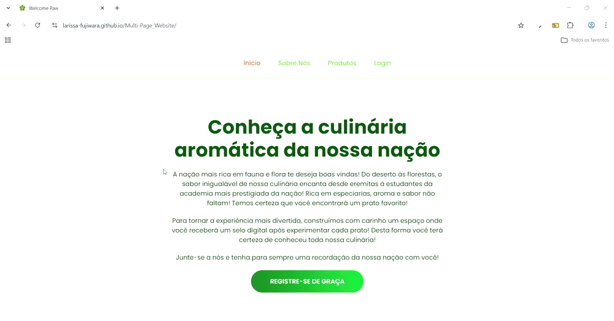

# Multi Page Website

**Descrição:** Projeto desenvolvido para fixação de conceitos de HTML e CSS.

**Tema do site:** Inspirado na nação de Sumeru de Genshin Impact

**Curso:** Learn HTML and CSS in 7 Days by Coding2GO

**URL:** <a style="font-weight:bold; font-size: 16px;" href="https://larissa-fujiwara.github.io/Multi-Page_Website/">Multipage Website</a>

## Preview do Site

## Tópicos deste projeto

- **Introdução ao HTML:**
    - HTML boilerplate;
    - tags semânticas;
    - incorporar vídeos (por questão de copyright, adicionei uma imagem no lugar do iframe);
    - Conceitos de box-model;
    - Formulários;
- **Introdução ao CSS:**
    - Conceitos de classes e IDs;
    - CSS combinators (descendant, child selector, next-sibling, subsequent-sibling, attribute selector);
    - Pseudo-seletores;
    - Pseudo-elementos;
    - Efeitos gradientes;
    - Box model;
    - Transições;

OBS: imagens geradas por inteligência artificial (Gemini);

